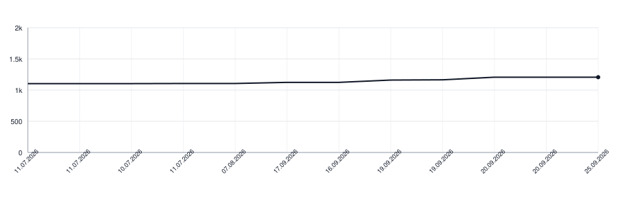

[](https://github.com/apakabarlabs/serbian-translit-swift/actions/workflows/tests.yml)
[](https://apakabarlabs.github.io/serbian-translit-swift/documentation/serbiantranslit/)

# serbian-translit-swift

Deterministic Serbian and Montenegrin script conversion, Cyrillic ↔ Latin.
Case preservation, digraph handling, quoted-region protection,
Roman-numeral and non-native-word filtering.

Swift port of [serbian-translit-python](https://github.com/apakabarlabs/serbian-translit-python).
Both share the same YAML rule table and test corpus, so behaviour is
identical across languages.

## Installation

Swift Package Manager. Add to `Package.swift`:

```swift
dependencies: [
    .package(url: "https://github.com/apakabarlabs/serbian-translit-swift", from: "0.4.1")
]
```

Then depend on the `SerbianTranslit` product from your target.

## Usage

```swift
import SerbianTranslit

SRP.toCyr("Njujork")
SRP.toCyr("LJUBAV")
SRP.toCyr("New York")
SRP.toCyr("grupa „AC/DC\"")
SRP.toLat("Њујорк")

CNR.toCyr("śever")
CNR.toLat("с́евер")
```

## Behaviour

- **Digraphs** `lj`, `nj`, `dž` (Latin) ↔ `љ`, `њ`, `џ` (Cyrillic) with
  case preservation (`Nj` in title-case position, `NJ` inside all-caps).
- **Montenegrin extras** `ś`, `ź` ↔ `с́`, `з́` (base letter + combining
  acute U+0301; no precomposed codepoints exist).
- **Đ variants** `Đ` (U+0110), `đ` (U+0111), `Ð` (U+00D0), `ð` (U+00F0)
  all map to `Ђ`/`ђ`.
- **Roman numerals** (`II`, `XIV`, `XX`) stay in Latin regardless of direction.
- **Words with non-native letters** (Latin `w`, `x`, `y`, `q`) are skipped
  whole; treated as foreign inclusions.
- **Quoted regions** (`"…"`, `„…"`, `“…”`, `«…»`) are preserved verbatim
  so brand names and foreign quotes survive round-trip.
- **URLs, emails, hashtags, @-mentions** are protected before word-splitting.
- **NFD input** is normalised to NFC first, so text from the iOS clipboard
  transliterates correctly.

## Requirements

- Swift 6.0
- iOS 15+, macOS 12+

## Documentation

The [Swift-DocC API reference](https://apakabarlabs.github.io/serbian-translit-swift/documentation/serbiantranslit/)
is generated from the public API on every push to `main`.

## Lines of Code

<picture>
  <source media="(prefers-color-scheme: dark)" srcset=".github/loc-history-dark.svg">
  <source media="(prefers-color-scheme: light)" srcset=".github/loc-history-light.svg">
  
</picture>
